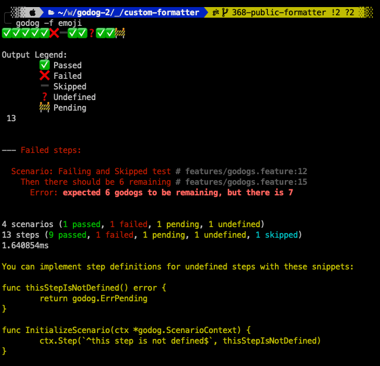

# Custom Formatter Example

This example custom formatter demonstrates some ways to build and use custom formatters with godog


## Emoji Progress

The first example is the Emoji formatter, built on top of the Progress formatter that is included with godog.

To run it:

```
$ godog -f emoji
```

Which would output step progress as emojis rather than text:

